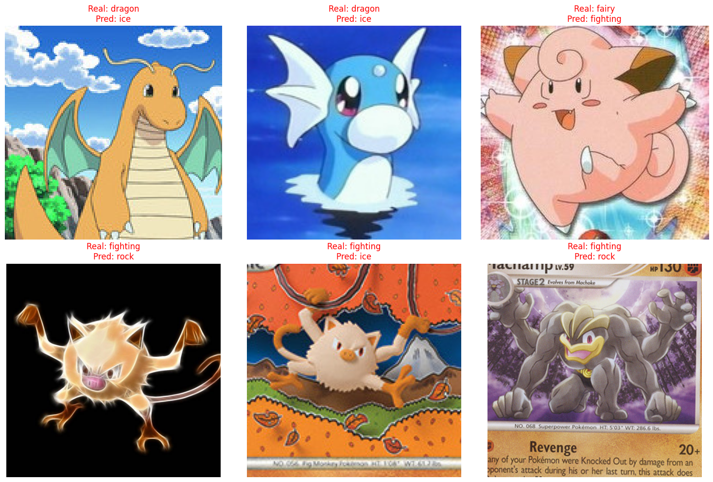

# Mi Proyecto: Clasificador Pokemon

## Descripcion
Este proyecto es una herramienta que clasifica el tipo de pokemon que se le sube como imagen en base a un entrenamiento realizado con imagenes de pokemones de la primera generacion (150 pokemons) en grupos por tipos (Solo se entreno con las clases (tipos): dragon, fairy, fighting, ghost, ice, rock).

## Demo
https://modeloclasificadortiposdepokemons-fcdfwj4q4maqy9wagftjdu.streamlit.app/

## Por que este tema
Escogi este tema porque es uno  de mis animes favoritos y siento que si bien estoy aplicando lo aprendido a un caso donde las entidades son ficticias (pokemons), podriamos aplicar esto mismo a entrenar modelos que clasifiquen razas de gatos, perros, aves, etc, o incluso familias de flores, arboles, plantas, etc.

Por lo cual estimo que este proyecto me ha permitido entender como podemos clasificar y entrenar a un modelo para que detecte y reconozca objetos, animales, plantas, etc.

Comparto un pequeno proyecto que realice hace un tiempo siempre sobre Pokemon https://basic-pokedex.vercel.app

## Dataset
- Total de imagenes: 1510
    - 1210 imágenes en el primer grupo (entrenamiento).
    - 300 imágenes en el segundo grupo (validacion o prueba).
- Clases: dragon, fairy, fighting, ghost, ice, rock
- Fuentes:
    - Se realizo la descarga del dataset pero se reclasifico cada imagen de los pokemons para generar una nueva clasificacion en base a sus tipos usando la Poke API.
    - https://www.kaggle.com/datasets/lantian773030/pokemonclassification?resource=download

## Resultados
Mejor accuracy obtenido: 90.67%

| Clase | Precision | Recall | F1-Score |
| :--- | :---: | :---: | :---: |
| **Dragon** | 0.XX | 0.XX | 0.XX |
| **Fairy** | 0.XX | 0.XX | 0.XX |
| **Fighting** | 0.XX | 0.XX | 0.XX |
| **Ghost** | 0.XX | 0.XX | 0.XX |
| **Ice** | 0.XX | 0.XX | 0.XX |
| **Rock** | 0.XX | 0.XX | 0.XX |
| **Promedio** | **0.XX** | **0.XX** | **0.91** |

## **Análisis de errores**
El modelo presenta una precisión alta, pero puede confundirse entre clases con características visuales similares, como los colores vibrantes en tipos Fairy y Dragon. También influyen los fondos complejos en imágenes que no son oficiales.
*(Incluye aquí 1-2 imágenes de ejemplos mal clasificados).*

## **Aprendizajes**
Lo más difícil fue gestionar la compatibilidad de versiones de Python y TensorFlow en el despliegue. Aprendí la gran eficacia del **Transfer Learning**, logrando pasar de un 59.9% a un 90.6% de precisión en solo 10 épocas utilizando los pesos pre-entrenados de **ResNet50**.

## Tecnologias usadas
- Python, TensorFlow/Keras
- Transfer Learning con ResNet50
- Streamlit para interfaz
- Streamlit Cloud para deploy

## Autor
Jose Obdulio Rivas Velasquez

## Repositorio
https://github.com/Obdulio-Rivas/modelo_clasificador_tipos_de_pokemons